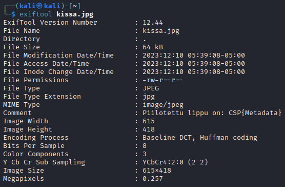

## Write up to complete the task

The task consists of the single image `kissa.jpg`. The idea is to check the metadata from the image, which reveals the hidden flag.

Steps to complete:

1. Install Exiftool if not already installed (TBD if it should already be installed on the target machine)

2. Run `exiftool kissa.jpg` to check the metadata from the image

3. This outputs the metadata, which reveals the hidden flag `CSP{METADATA}`:

