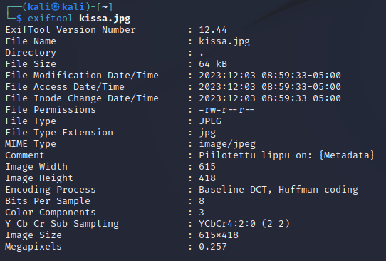

## Write up to complete the task

The task consists of the single image `kissa.jpg`. The idea is to extract the metadata from the image, which reveals the hidden flag.

Steps to complete:

1. Install Exiftool if not already installed (TBD if it should already be installed on the target machine)

2. Run the following command to extract the metadata from the image:
```console
$ exiftool kissa.jpg
```

3. This outputs the metadata, shich reveals the hidden flag:

